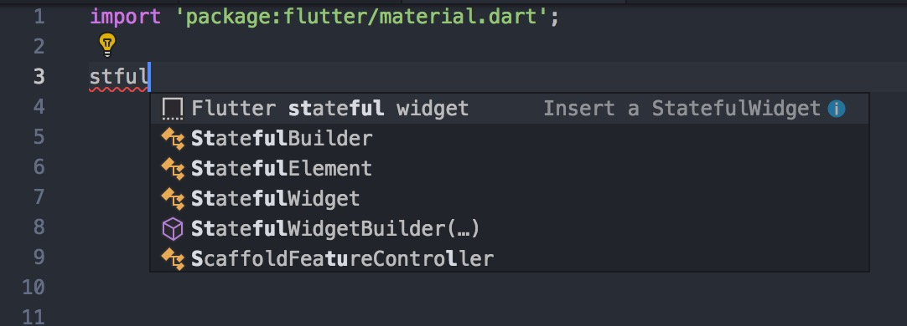
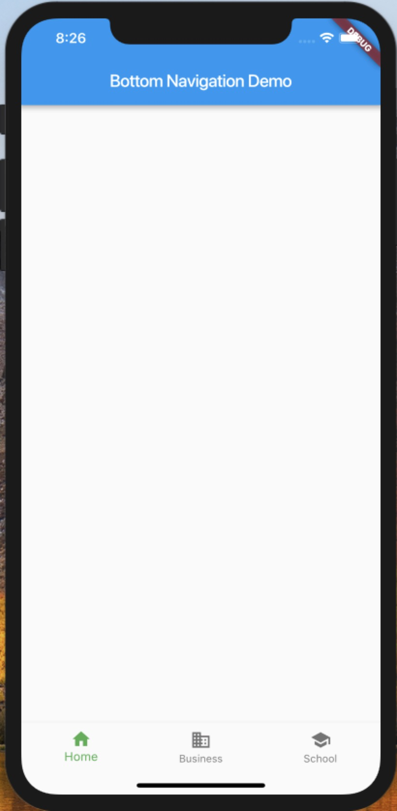

现如今打开一个 App，比如微信、支付宝，都能看到一个底部导航栏，用来切换到不同的展示页。今天就用 Flutter 实现一下这种效果。

---

在 Flutter 里，基本上所有的东西都是组件。Flutter 也已经有了现成的底部导航栏组件了 -- BottomNavigationBar，所以用 Flutter 实现底部导航，其实是很简单地一件事情，只需要知道怎么使用就好了。

1. 首先，利用 IDE 实现代码大致的结构

```dart
import 'package:flutter/material.dart';

class BottomNav extends StatefulWidget {
  @override
  _BottomNavState createState() => _BottomNavState();
}

class _BottomNavState extends State<BottomNav> {
  @override
  Widget build(BuildContext context) {
    return Container(

    );
  }
}
```

笔者用的是 vs code，然后有安装 flutter 、dart 的插件。要实现上述的结构，只要在编辑器中输入 stful，然后就会有提示出来了，如图所示：


vs code 编辑器会 dart 的支持是十分友好的了，也有很多提示，在编码时可以充分利用。目前唯一的缺点应该就是缺少 flutter inspector 了。

2.  实现\_BottomNavState 的 build 方法

```dart
class _BottomNavState extends State<BottomNav> {
  @override
  Widget build(BuildContext context) {
    return Scaffold(
      appBar: AppBar(title: Text('Bottom Navigation Demo')),
      bottomNavigationBar: BottomNavigationBar(
        items: [
          BottomNavigationBarItem(icon: Icon(Icons.home), title: Text('Home')),
          BottomNavigationBarItem(icon: Icon(Icons.business), title: Text('Business')),
          BottomNavigationBarItem(icon: Icon(Icons.school), title: Text('School')),
        ],
        fixedColor: Colors.green,
        currentIndex: 0,
        onTap: (int idx) {}
      ),
    );
  }
}
```

这时候，用仿真器看到的效果如下：


3. 添加交互

到这里，我们已经实现了大概的效果，但是你会发现，点击底部的图标切换，是没有效果的。现在，就给底部导航添加交互行为。

- 定义变量\_currentIndex,  并将 BottomNavagationBar 的 currentIndex 的  值用变量 \_currentIndex 代替

```dart
int _currentIndex = 0;
```

- 实现 BottomNavagationBar 的 onTap 方法

```dart
void onItemTapped(int idx) {
  setState(() {
    _currentIndex = idx;
  })
}
```

至此，就完成了底部导航栏的功能啦。

完成代码请看这里 [bottom_navagation_bar.dart](../codes/bottom_navigation_bar.dart)

## 参考资料

[BottomNavigationBar class](https://docs.flutter.io/flutter/material/BottomNavigationBar-class.html)
