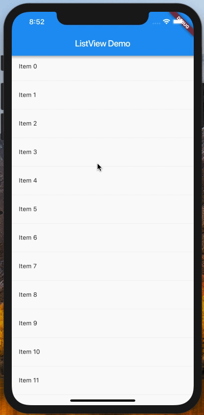

现如今打开一个 App，比如头条、微博，都会有长列表，随着我们不断地滑动，视窗内的内容也会不断地更新。今天就用 Flutter 实现一下这种效果。



---

这里的表现其实就相当于有一个固定长度的容器，然后超出的内容是不可见的，只有当你向上或向下滑动屏幕时，视窗外看不见的内容才会出现在视窗中。如果在 web 开发时，是需要容器加上样式
```css
overflow: auto;
```
要想用 Flutter 实现，其实也是很简单的，因为 Flutter 为我们提供了 ListView 组件。

ListView 主要有以下几种使用方式
- ListView
- ListView.builder
- ListView.separated
- ListView.custom

## ListView

ListView 是最简单直接的方式，简单，那么适用的场景也是简单的。仅适用于内容较少的情形，因为它是一次性渲染所有的 items ，当 items 的数目较多时，很容易出现卡顿现象的，导致滑动不流畅。 你可以试试加大下面 items 的大小，然后对比一下体验效果。

```dart
class ListViewDemo extends StatelessWidget {
  final _items = List<Widget>.generate(10,
      (i) => Container(padding: EdgeInsets.all(16.0), child: Text("Item $i")));

  @override
  Widget build(BuildContext context) {
    return ListView(
      children: _items,
    );
  }
}

```

## ListView.builder()

构造函数 builder 要求传入两个个参数，`itemCount` 和 `itemBuilder` 。前者规定 列表数目的多少，后者决定了每个列表如何渲染。跟 ListView 不同的点在于，这是懒加载的，假如有 1000 个列表，初始渲染时并不会所有都渲染，而只会特定数量的 item ，这对于性能和用户体验来说，是很好的提升。 你可以对比用 ListView 和用 ListView.builder 渲染 1000 个列表时，体验是否有差别。

```dart
class ListViewDemo extends StatelessWidget {
  final _items = List<String>.generate(1000, (i) => "Item $i");

  @override
  Widget build(BuildContext context) {
    return ListView.builder(
      itemCount: 1000,
      itemBuilder: (context, idx) {
        return Container(
          padding: EdgeInsets.all(16.0),
          child: Text(_items[idx]),
        );
      },
    );
  }
}
```

## ListView.separated()
separated 相比较于 builder，又多了一个参数 `separatorBuilder` ，用于控制列表各个元素的间隔如何渲染。比如，我们需要列表的每个 item 之间有一个分割线，就可以跟下面那样，加一个 Divider 组件。
```dart
class ListViewDemo extends StatelessWidget {
  final _items = List<String>.generate(1000, (i) => "Item $i");

  @override
  Widget build(BuildContext context) {
    return ListView.separated(
      itemCount: 1000,
      itemBuilder: (context, idx) {
        return Container(
          padding: EdgeInsets.all(16.0),
          child: Text(_items[idx]),
        );
      },
      separatorBuilder: (context, idx) {
        return Divider();
      },
    );
  }
}
```

## ListView.custom()
custom，就跟名字一样，让我们自定义。必须的参数就是 `childrenDelegate` , 然后传入一个 实现了 `SliverChildDelegate` 的组件，如 `SliverChildListDelegate` 和 `SliverChildBuilderDelegate` 。 

`SliverChildListDelegate` 接收跟 ListView 一样的 `children`，而 `SliverChildBuilderDelegate` 接收跟 ListView.builder 的 `itemBuilder` 一样类型的函数。

正常来说，前面三个已经可以满足我们的日常使用需求了，无需自定义。

---

总结，上面主要讨论了 ListView 的几个构造函数及用法，讨论如何实现常见的滚动列表。

完成的代码，可见 [list_view.dart](../code/list_view.dart) 。

## 参考资料
[Flutter ListView and ScrollPhysics: A Detailed Look](https://medium.com/flutter-community/flutter-listview-and-scrollphysics-a-detailed-look-7f0912df2754)

[ListView class](https://docs.flutter.io/flutter/widgets/ListView-class.html)